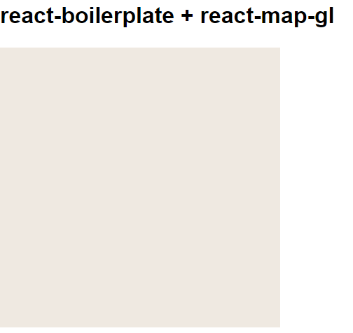
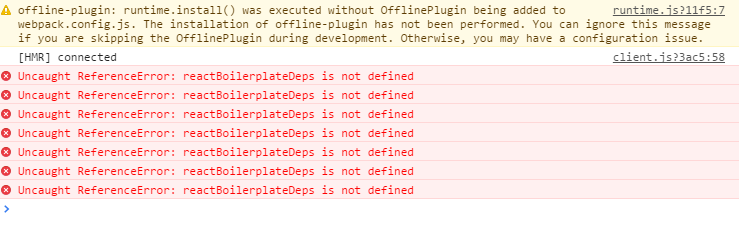
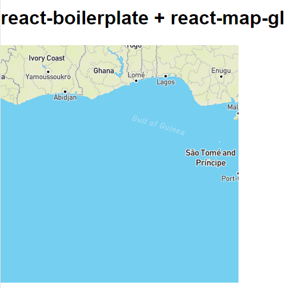

[react-boilerplate](https://github.com/mxstbr/react-boilerplate) + [react-map-gl](https://github.com/uber/react-map-gl) incompatibility example
=============


How to reproduce the problem
-----

1. Investigate the commit history to see what was added on top of a clean boilerplate.  
Sources for these steps:  
https://github.com/mapbox/mapbox-gl-js/blob/master/webpack.config.example.js  
https://github.com/uber/react-map-gl/issues/21#issuecomment-224191900  

2. Clone

3.
```bash
npm start
```

4. See this (the map is empty + errors in console):





5.
```bash
npm build
```

4. Open the contents of `/build/` on some virtual host and see this (the map is being rendered):


